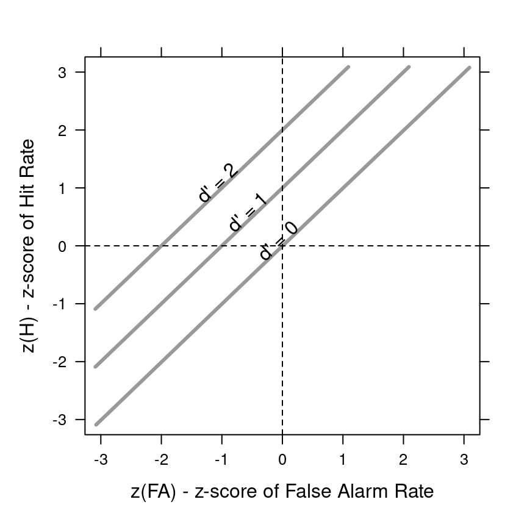

## Outline


::: {.cell}

:::


::: nonincremental
1.  What is *Signal Detection Theory*?

2.  Equal-variance Gaussian model

3.  Equal-variance SDT as generalised linear model (GLM)

4.  Unequal-variance SDT
:::

# (1) Signal Detection Theory

## Signal Detection Theory (SDT)

:::::: columns
:::: {.column width="70%"}
::: nonincremental
-   *"A framework of statistical methods used to model how observers classify sensory events"*\
    (Knoblauch & Maloney, 2012)

-   Developed in the 1950s in studies of perception

-   Can be applied to any task involving detection of a *"signal"* in *"noise"*

-   Allows explaining behaviour in terms of **bias** and **sensitivity**
:::
::::

::: {.column width="30%"}
   

{fig-align="center" width="90%"}
:::
::::::

## Signal detection theory (SDT) {.nonincremental}

 

4 possible outcomes when trying to detect a signal in noise

:::::::::::: columns
::: {.column width="55%"}
   

+------------+------------+------------------------+
|            |            | *Stimulus space*       |
+------------+------------+------------------------+
|            | **Signal** | **Not signal**         |
+------------+------------+------------------------+
| *Decision\ | **Yes**    | Hit (H)                |
| space*     |            |                        |
+------------+------------+------------------------+
| **No**     | Miss (M)   | Correct rejection (CR) |
+------------+------------+------------------------+
:::

::: {.column width="5%"}
:::

::::::::: {.column width="40%"}
 

::::: fragment
["Desirable" outcomes:]{style="color:#198754"}

:::: nonincremental
::: {style="font-size: 70%;"}
-   [[**Hit**]{.underline} **(H):** Correctly detect signal]{style="color:#198754"}
-   [[**Correct rejection**]{.underline} **(CR):** Correctly say no signal]{style="color:#198754"}
:::
::::
:::::

::::: fragment
 

[Errors:]{style="color:#dc3545"}

:::: nonincremental
::: {style="font-size: 70%;"}
-   [[**Miss**]{.underline} **(M):** Fail to detect signal]{style="color:#dc3545"}
-   [[**False alarm**]{.underline} **(FA):** Mistakenly detect signal]{style="color:#dc3545"}
:::
::::
:::::
:::::::::
::::::::::::

 

-   When information is incomplete/ambiguous, we make mistakes (M or FA).
-   SDT can provide *optimal* decision rules, even with unequal priors/payoffs.

## Simulating a signal detection experiment in R

 

We need 2 parameters; e.g. $p(\text{H})$ and $p(\text{FA})$


::: {.cell}

:::

::: {.cell}

```{.r .cell-code}
N <- 150
pH <- 0.9
pFA <- 0.1
H <- rbinom(1, N, pH)
M <- N - H
FA <- rbinom(1, N, pFA)
CR <- N - FA

SDT_tab <- as.table(matrix(c(H, M, FA, CR), 
                           nc = 2, 
                           dimnames = list(Decision = c("Yes", "No"), 
                                           Stimulus = c("Signal", "Not Signal"))))
print(SDT_tab)
```

::: {.cell-output .cell-output-stdout}

```
        Stimulus
Decision Signal Not Signal
     Yes    137         14
     No      13        136
```


:::
:::


## SDT assumptions

 

[**Noisy measurements**]{.underline}: on each trial the observer's information about the stimulus can be modelled as a random variable $X$, drawn from the *signal distribution* $f_S$, and drawn from the *noise distribution* $f_N$ otherwise.

 

::: {style="font-size: 80%;"}
-   In theory, no restrictions on how we choose $f_S$ and $f_N$.

-   In practice they are often assumed to be Gaussian.
:::

## SDT distributions

 

*Equal-variance* Gaussian SDT


::: {.cell .fig-cap-location-margin layout-align="center"}
::: {.cell-output-display}
{fig-align='center' width=576}
:::
:::


::: {style="font-size: 70%;"}
$\sigma = 1$ for both signal and noise distributions
:::

## SDT distributions

 

*Un* equal-variance Gaussian SDT


::: {.cell .fig-cap-location-margin layout-align="center"}
::: {.cell-output-display}
{fig-align='center' width=576}
:::
:::


::: {style="font-size: 70%;"}
$\sigma_{f_S} = 1.5 \sigma_{f_N}$
:::

## SDT distributions

 

*Extreme-value* SDT


::: {.cell .fig-cap-location-margin layout-align="center"}
::: {.cell-output-display}
{fig-align='center' width=576}
:::
:::


::: {style="font-size: 70%;"}
$\text{Gumbel}_{\text{min}}$ distribution to model recognition memory ([Meyer-Grant et al , 2025](https://osf.io/preprints/psyarxiv/qhrfj_v2))
:::

## SDT distributions

 

*Exponential* SDT


::: {.cell .fig-cap-location-margin layout-align="center"}
::: {.cell-output-display}
{fig-align='center' width=576}
:::
:::


## *Optimal* detection

-   The decision rule that maximises the probability of a correct response is based on the *likelihood ratio* $$\frac{f_S(x)}{f_N(x)}$$

-   The likelihood ratio is compared to a criterion ($\beta$), which should be set based on the prior probability of a signal $\alpha$,$$\beta=\frac{1-\alpha}{\alpha}$$

-   That is, the observer should respond "yes" (*signal present*) whenever $$\frac{f_S(x)}{f_N(x)} \ge \beta$$

::: notes
Note that $\beta=1$ when signal and noise have the same probability
:::

## *Optimal* detection with asymmetric payoffs

-   Payoffs are often asymmetric (e.g. a miss-detection may be more costly than a false alarm)

 

-   We can set a criterion that maximizes *utility* taking the payoffs into account$$\beta=\frac{\left(1-\alpha \right)}{\alpha}  \frac{\left(U_{\text{CR}}-U_{\text{FA}}\right)}{\left(U_{\text{H}}-U_{\text{M}}\right)}$$\
    (where $U_{\text{CR}}, U_{\text{FA}}, U_{\text{H}}$ and $U_{\text{M}}$ are the payoffs for correct rejections, false alarms, hits, and missed detections, respectively)

 

-   Sometime referred to as *Bayes criterion*

# Equal-variance, Gaussian signal detection theory (EV-SDT)

## EV-SDT


::: {.cell .fig-cap-location-margin layout-align="center"}
::: {.cell-output-display}
{fig-align='center' width=640.32}
:::
:::


::: {style="font-size: 80%;"}
In equal-variance SDT (EV-SDT) the observer's ability to discriminate signals from noise is captured by the *sensitivity* parameter $d'$
:::

## EV-SDT


::: {.cell .fig-cap-location-margin layout-align="center"}
::: {.cell-output-display}
{fig-align='center' width=640.32}
:::
:::


::::::: {style="font-size: 80%;"}
:::::: columns
::: {.column width="50%"}
$$\begin{aligned}
f_S(x)&=\frac{1}{\sigma\sqrt{2 \pi}} e^{-\frac{(x-d')^2}{2 \sigma^2}}\\
&=\frac{1}{\sqrt{2 \pi}} e^{-\frac{(x-d')^2}{2}}
\end{aligned}$$
:::

:::: {.column width="50%"}
::: fragment
$$f_N(x)=\frac{1}{\sqrt{2 \pi}} e^{-\frac{x^2}{2}}$$
:::
::::
::::::
:::::::

## EV-SDT criterion


::: {.cell .fig-cap-location-margin layout-align="center"}
::: {.cell-output-display}
{fig-align='center' width=640.32}
:::
:::


::: {style="font-size: 80%;"}
In EV-SDT, the (optimal) likelihood ratio decision rule is equivalent to thresholding $X$ at

$$c = \frac{1}{d'}\log \underbrace{\left[\frac{1-\alpha}{\alpha}\right]}_{\beta}+ \frac{d'}{2}$$ and choose "yes" whenever $x \ge c$.
:::

## EV-SDT: criterion


::: {.cell .fig-cap-location-margin layout-align="center"}
::: {.cell-output-display}
{fig-align='center' width=640.32}
:::
:::


::: {style="font-size: 80%;"}
$$p(\text{FA})=1-\Phi(c)$$

(where $\Phi$ is the cumulative distribution function of the Gaussian with mean 0 and variance 1)
:::

## EV-SDT: criterion


::: {.cell .fig-cap-location-margin layout-align="center"}
::: {.cell-output-display}
{fig-align='center' width=640.32}
:::
:::


::: {style="font-size: 80%;"}
$$p(\text{CR})=\Phi(c)$$
:::

## EV-SDT: criterion


::: {.cell .fig-cap-location-margin layout-align="center"}
::: {.cell-output-display}
{fig-align='center' width=640.32}
:::
:::


::: {style="font-size: 80%;"}
$$p(\text{H})=1 - \Phi(c - d')$$
:::

## EV-SDT: criterion


::: {.cell .fig-cap-location-margin layout-align="center"}
::: {.cell-output-display}
{fig-align='center' width=640.32}
:::
:::


::: {style="font-size: 80%;"}
$$p(\text{M})= \Phi(c - d')$$
:::

## EV-SDT: optimal criterion derivation {background-color="#202A30"}

::: {style="font-size: 80%;"}
 

To derive the optimal-criterion, starts from:$$\frac{f_S(x)}{f_N(x)} \ge \beta$$

substitute with the formula of the Gaussian probability density functions:$$\frac{\frac{1}{\sqrt{2 \pi}} e^{-\frac{(x-d')^2}{2}}}{\frac{1}{\sqrt{2 \pi}} e^{-\frac{x^2}{2}}} \ge \beta$$

simplify and take the log of both sides:$$\log \left[\frac{e^{-\frac{(x-d')^2}{2}}}{e^{-\frac{x^2}{2}}} \right] \ge \log \left[ \beta \right]$$

then solve for $x$
:::

## Fitting the EV-SDT model to data

 

We can find maximum likelihood estimators (MLE) of $d'$ and $c$ by inverting the formulas for $p(\text{H})$ and $p(\text{FA})$ [^1]

[^1]: The standard normal CDF is symmetric about 0: $\Phi(-z)=1-\Phi(z)$. That turns $1-\Phi(c)$ into $\Phi(-c)$ (and similarly for $c-d'$).

$$p(\text{FA}) = 1 - \Phi(c) \implies c = - \Phi^{-1}\left[p(\text{FA})\right]$$  

::: fragment
$$\begin{aligned}p(\text{H}) = 1 - \Phi(c - d') \implies  d' & = \Phi^{-1}\left[p(\text{H})\right] +c \\ & =\Phi^{-1}\left[p(\text{H})\right] - \Phi^{-1}\left[p(\text{FA})\right]\end{aligned}$$
:::

 

::: {style="font-size: 80%;"}
where $\Phi^{-1}$ is the inverse of the cumulative distribution function\
(also referred to as *quantile* function).
:::

## The Receiver Operating Characteristic (ROC) curve

::: {style="font-size: 85%;"}
 

The ROC curve traces $(\mathrm{FA}(c), \mathrm{H}(c))$ as the criterion $c$ moves from liberal → conservative.

 


::: {.cell layout-align="center"}
::: {.cell-output-display}
{fig-align='center' width=480}
:::
:::


-   Under EV–SDT with noise $\mathcal{N}(0,1)$ and signal $\mathcal{N}(d',1)$: $\mathrm{FA}(c)=\Phi(-c),\quad \mathrm{H}(c)=\Phi(d'-c).$

-   Area under the curve (**AUC** or **aROC)** measures overall separability;\
    for EV–SDT: $\mathrm{AUC}=\Phi\!\left(\frac{d'}{\sqrt{2}}\right).$
:::

## The zROC curve

:::: {style="font-size: 85%;"}
 

If we plot quantiles ($\Phi^-1\left[p(\text{FA})\right]$ and $\Phi^-1\left[p(\text{H})\right]$), also referred to as *Z-scores* ($z(\text{FA})$ and $z(\text{H})$), instead of probabilities the ROC curve becomes a straight line


::: {.cell layout-align="center"}
::: {.cell-output-display}
{fig-align='center' width=480}
:::
:::


::: fragment
For the EV-SDT model, the equation of the line is $z(\text{H}) = d' + z(\text{FA})$\
(This implies that the slope is 1 and the intercept is the $d'$)
:::
::::

# SDT as Generalised Linear Model (GLM)

## EV–SDT as a GLM

 

::::::: {style="font-size: 80%;"}
Let $Y\in\{0,1\}$ be the binary response (*"Yes"=1*) and\
$S\in\{0,1\}$ a binary predictor (*"signal present" = 1; "noise only" = 0*).

 

::: fragment
In equal-variance SDT, we have: $$\begin{aligned} p(\text{FA}) & = p(Y=1\mid S=0)= \Phi(-c) \\ p(\text{H})  & = p(Y=1\mid S=1)=\Phi(d'-c).\end{aligned}$$
:::

::: fragment
Combining both cases: $$p(Y=1\mid S)=\Phi(-c + d' \,S )$$
:::

 

::: fragment
This is equivalent to a Generalised Linear Model (GLM) with *probit* link function: $$\Phi^{-1}\left[P(Y=1\mid S)\right]=\beta_0+\beta_1 S,\quad
\text{where }\beta_0=-c,\ \beta_1=d'.$$
:::

 

::: fragment
[**Framing the EV-SDT model as a *probit* GLM lets you use standard packages to model multiple conditions and interactions or include random effects.**]{style="color:red;"}
:::
:::::::

## Multilevel SDT

Using GLM parametrisation it is easy to fit multilevel SDT model (e.g. using the `lme4` package in R)

$$\Phi^{-1}\left[P(Y=1\mid S, i)\right]=(\beta_0 + \mu_{0,i})+(\beta_1+ \mu_{0,i}) S$$ where the parameters of the $i$-th subject are $$c=-(\beta_0+\mu_{0,i}),\ d'=\beta_1 +  \mu_{1,i}$$

 

and we assume that participant-specific *random effects* (deviations from group-level *fixed* effects) have a multivariate Gaussian distribution

$$\left[ {\begin{array}{c}
{{\mu_0}}\\
{{\mu_1}}
\end{array}} \right] \sim\cal N \left( {\left[ {\begin{array}{c}
0 \\ 0 \end{array}} \right],\Sigma  } \right)$$

::: fragment
[Multilevel models pool information across participants, making estimates more robust, and can be particularly useful when many repetitions aren’t feasible]{style="color:red;"} (*e.g. knowledge questions, see Activity 4 in the worksheet*).
:::

# Unequal-variance SDT

## Unequal-variance SDT (UV-SDT)

:::::: {style="font-size: 85%;"}
In some settings the **signal** is not just shifted but also **noisier** than the baseline\
(e.g., neural firing rates: higher mean → higher variance).

-   Noise:$X\sim\mathcal N(0,\,1)$
-   Signal: $X\sim\mathcal N(d',\,\sigma^2)$ with $\sigma\neq 1$

 

::: fragment
The log-likelihood ratio (LLR) becomes a quadratic function of $x$: $\log\!\frac{f_S(x)}{f_N(x)}= -\frac{1}{2\sigma^2}\Big[(1-\sigma^2)x^2 - 2d' x + d'^2 + 2\sigma^2\log\sigma\Big].$
:::

 

::: fragment
The decision rule is always $\log\!\frac{f_S(x)}{f_N(x)}>\log\beta$.
:::

::: fragment
For $\sigma>1$, this inequality is satisfied in *two tails* → *two criteria*.


::: {.cell layout-align="center"}
::: {.cell-output-display}
{fig-align='center' width=672}
:::
:::


:::
::::::

## Unequal-variance SDT (UV-SDT)

::: {style="font-size: 85%;"}
This is more clearly seen when looking at the log-likelihood ratio.


::: {.cell layout-align="center"}
::: {.cell-output-display}
{fig-align='center' width=672}
:::
:::


*Intuition*: with $\sigma > 1$, extreme (low or high) evidence is more likely under the signal than the noise, so “Yes” in both tails and “No” in the middle.
:::

## ROC & zROC in equal vs unequal variance (and testing EV)

:::::: {style="font-size: 85%;"}
-   Different variance in signal/noise distributions change the shape of the ROC curve
-   The zROC curve remains a straight line, but the slope is $\ne1$ anymore
-   Assuming noise Std. fixed at 1, the zROC slope is $\frac{1}{\sigma}$

::: fragment


::: {.cell layout-align="center"}
::: {.cell-output-display}
{fig-align='center' width=672}
:::
:::


:::

:::: fragment
::: small
-   Measuring the slope of the zROC is a way to assess whether the equal-variance assumption is warranted.
-   Measuring the slope is not simple! We need to measure $p(\text{H})$ and $p(\text{FA})$ under varying criterion setting, which should be induced by changing the prior or the payoffs
-   An alternative could be using rating scales, but there are pitfalls (e.g. [Maniscalco & Lau, 2014](https://link.springer.com/chapter/10.1007/978-3-642-45190-4_3))
:::
::::
::::::

# 

## Take-home messages

-   SDT cleanly separates **sensitivity** ($d'$) from **bias** ($c$) in detection tasks.

-   Framing SDT as a **probit GLM** lets you use standard tools: **mixed-effects** (random effects), multi-condition designs, interactions, covariates, and Bayesian fitting.

-   Don’t assume equal variance by default. If possible, check the zROC slope; alternatively critically evaluate why assuming equal variance is warranted.

-   With minor tweaks, the same machinery (optimal criteria, ROC/zROC, AUC) applies to discrimination tasks as well as detection.

## References

::: nonincremental
-   Green, D. M., & Swets, J. A. (1966). *Signal detection theory and psychophysics.* Wiley.

-   Knoblauch, K., & Maloney, L. T. (2012). *Modeling psychophysical data in R.* Springer. <https://doi.org/10.1007/978-1-4614-4475-6>

-   Wickens, T. D. (2001). *Elementary signal detection theory.* Oxford University Press.
:::

<!-- ## Sensitivity in UV–SDT: the $d_a$ index -->

<!-- :::: {style="font-size: 85%;"} -->

<!-- When variances differ sensitivity is not well summarised by $d'$.\ -->

<!-- An alternative is $d_a$, defined from the **zROC** line. -->

<!-- Let the **zROC** be -->

<!-- $$z(\mathrm{H}) = a + s\,z(\mathrm{FA}),$$ -->

<!-- where $z=\Phi^{-1}$, $s$ is the **zROC slope** (for noise SD fixed to 1, $s=1/\sigma$), and $a$ the intercept. -->

<!-- Then -->

<!-- $$\boxed{\; -->

<!-- d_a \;=\; \sqrt{\frac{2}{1+s^2}}\;\big[z(\mathrm{H}) - s\,z(\mathrm{FA})\big] -->

<!-- \;=\; \sqrt{\frac{2}{1+s^2}}\;a -->

<!-- \;}$$ -->

<!-- - If **equal variance** (\(\sigma=1\Rightarrow s=1\)): \(d_a = z(\mathrm{H})-z(\mathrm{FA}) = d'\). -->

<!-- - If **unequal variance** (\(s\neq 1\)): \(d_a\) stays **criterion-free** and reflects separation scaled by average SD. -->

<!-- ::: fragment -->

<!-- ```{r, echo=FALSE} -->

<!-- #| fig-align: 'center' -->

<!-- #| fig.height: 3.2 -->

<!-- #| fig.width: 7 -->

<!-- # Example: build a small zROC, estimate slope/intercept, compute d_a -->

<!-- # Choose a model (UV): d′=2, sigma=1.6 -> slope s = 1/sigma = 0.625 -->

<!-- dprime <- 2; sigmaS <- 1.6 -->

<!-- c_grid <- seq(-3, 5, length.out = 25) -->

<!-- FA <- 1 - pnorm(c_grid)                      # FA(c) -->

<!-- H  <- 1 - pnorm((c_grid - dprime)/sigmaS)    # H(c) -->

<!-- zFA <- qnorm(pmin(pmax(FA, 1e-6), 1 - 1e-6)) -->

<!-- zH  <- qnorm(pmin(pmax(H,  1e-6), 1 - 1e-6)) -->

<!-- fit <- lm(zH ~ zFA) -->

<!-- s_hat <- unname(coef(fit)[2])     # zROC slope (≈ 1/sigmaS) -->

<!-- a_hat <- unname(coef(fit)[1])     # intercept -->

<!-- d_a_hat <- sqrt(2/(1 + s_hat^2)) * a_hat -->

<!-- round(c(slope = s_hat, intercept = a_hat, d_a = d_a_hat), 3) -->

<!-- # Plot zROC -->

<!-- plot(zFA, zH, pch = 19, cex = .7, xlab = "z(FA)", ylab = "z(H)") -->

<!-- abline(fit, col = "red", lwd = 2) -->

<!-- ``` -->

<!-- ::: -->

<!-- :::: -->
